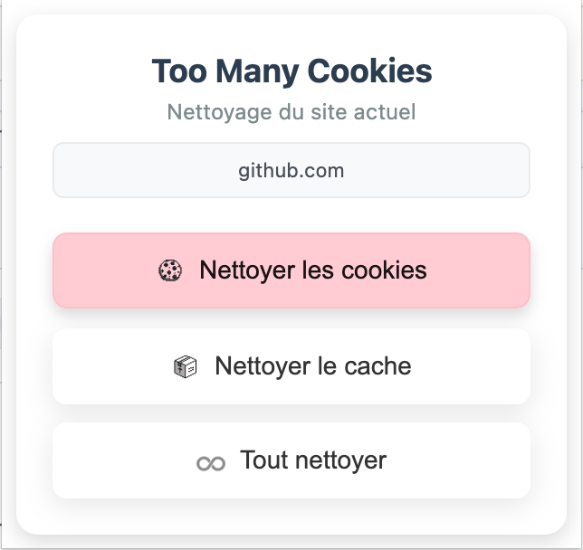

# 🍪 Too Many Cookies

**Extension Chrome pour nettoyer cookies et cache du site actuel**

## ✨ Fonctionnalités

🍪 **Cookies** • 🗂️ **Cache** • 🧹 **Tout nettoyer**

## 🚀 Installation

1. Cloner le projet
2. Aller à `chrome://extensions/`
3. Activer le "Mode développeur"
4. "Charger l'extension non empaquetée"

